# Architecture — Couples App

> Source of truth for **how the system is structured**. Read this before adding a new feature or touching layer boundaries. Any change to architecture rules must come with an ADR in `DECISIONS.md`.
> Last updated: 2026-05-07
>
> **Diagrams** are rendered to PNG in [`./diagrams/`](./diagrams/) and embedded inline below. The Mermaid source is preserved in collapsible blocks for in-document editing. Re-render with `python3 diagrams/render.py`.

---

## TL;DR

We use **Pragmatic Clean Architecture**. The codebase is split into four layers, and **dependencies always point inward**:

```
infrastructure / delivery   →   adapters   →   application   →   domain
        (Next.js,                (Supabase                       (pure TS,
         Server Actions,          repos, Zod                      no framework
         routes)                  validators)                     imports)
```

Inner layers know nothing about outer layers. The **domain** is pure TypeScript, the **application** layer holds use cases that depend on repository *interfaces*, and **adapters** implement those interfaces with real infrastructure (Supabase, Next.js).

Adding a feature means adding new entities + use cases that don't touch existing code. That's the Open/Closed Principle, made physical.

---

## The four layers (rules and content)

### 1. Domain layer — `src/features/<feature>/domain/`

**Purpose:** model the business concepts of the couples app.

**Allowed in this layer:**
- Pure TypeScript: `type`, `interface`, classes, pure functions
- Branded types for IDs (`UserId`, `CoupleId`, `TodoId`)
- Domain errors (`TodoValidationError`, `AlreadyPairedError`)
- Pure invariants (e.g. "a todo title must be 1–200 chars after trimming")

**Forbidden:**
- `import` from anything in `next/`, `@supabase/*`, `react`, `zod`, or any I/O lib
- Side effects (no `fetch`, no `Date.now()` if avoidable — pass time in)
- Any awareness of database, HTTP, or UI

**Why so strict:** the domain layer should be liftable into a separate package and unit-tested without spinning up Next.js or Supabase. If it imports a framework, the dependency rule has been violated.

### 2. Application layer — `src/features/<feature>/application/`

**Purpose:** orchestrate domain logic into use cases. One file per use case (`createTodo.ts`, `signUp.ts`, `pairCouple.ts`).

**Allowed:**
- Imports from the same feature's `domain/`
- Imports from `src/shared/domain/` (cross-feature primitives)
- Repository **interfaces** (defined in this layer, e.g. `TodoRepository.ts`)
- Use case factory functions: `makeCreateTodo({ todos, ... }) => async (input) => ...`

**Forbidden:**
- Direct imports from `@supabase/*`, `next/*`, or any specific repository implementation
- HTTP or framework concerns

**Pattern:** every use case is a factory that takes a `Deps` object. Dependencies are interfaces, never concrete classes.

### 3. Adapters layer — `src/features/<feature>/adapters/`

**Purpose:** translate between the application layer and the outside world.

**Contains:**
- Repository implementations: `SupabaseTodoRepository.ts` implements the `TodoRepository` interface from `application/`
- Zod validators (`schema.ts`)
- Server actions (`actions.ts`) — Next.js boundary: parse FormData → call use case → revalidate
- Composition root (`composition.ts`) — wires real repos + use cases together
- Presenters / DTO mappers if needed

**Allowed:** imports from this feature's `application/` and `domain/`, plus `next/*`, `@supabase/*`, `zod`, and shared infrastructure.

### 4. Infrastructure / delivery — `app/` and `src/shared/infrastructure/`

**Purpose:** the framework edge — Next.js routing, Supabase client setup, env config.

**Contains:**
- `app/` — Next.js App Router pages and layouts (kept thin; pages call into feature UI components and server actions)
- `src/shared/infrastructure/supabase/` — server and browser Supabase clients
- `src/shared/infrastructure/env.ts` — typed environment variables (Zod-validated)

---

## The dependency rule (one rule that matters most)

```
infrastructure  →  adapters  →  application  →  domain
```

You may **only import from a layer at the same level or further inward**. Never the reverse.

Concrete examples:

| File | Allowed to import from | Forbidden |
|---|---|---|
| `domain/Todo.ts` | other `domain/` files in same feature, `src/shared/domain/` | everything else |
| `application/createTodo.ts` | `domain/`, application interfaces in same feature, `src/shared/domain/` | adapters, infrastructure, frameworks |
| `adapters/SupabaseTodoRepository.ts` | `domain/`, `application/`, `@supabase/*`, shared infra | `app/` (the route pages) |
| `app/(app)/todos/page.tsx` | feature UI components, server actions, application use cases via composition | reaching into `domain/` directly *(pages should call use cases, not domain)* |

Claude Code: if you're tempted to write `import { ... } from "@supabase/supabase-js"` inside `application/` or `domain/`, **stop and reconsider** — you're building the wrong layer.

---

## Folder structure

```
couples-app/
├── app/                                # Next.js App Router (delivery)
│   ├── (auth)/
│   │   ├── login/page.tsx
│   │   ├── signup/page.tsx
│   │   └── reset/page.tsx
│   ├── (app)/
│   │   ├── todos/page.tsx
│   │   ├── couple/page.tsx
│   │   └── settings/page.tsx
│   ├── api/                            # route handlers if needed
│   ├── layout.tsx
│   └── manifest.webmanifest
│
├── src/
│   ├── features/
│   │   ├── auth/
│   │   │   ├── domain/                 # User, Email value object, AuthErrors
│   │   │   ├── application/            # signUp.ts, signIn.ts, UserRepository.ts
│   │   │   ├── adapters/               # SupabaseUserRepository.ts, actions.ts, schema.ts, composition.ts
│   │   │   ├── ui/                     # SignUpForm.tsx, LoginForm.tsx
│   │   │   └── __tests__/
│   │   ├── couple/
│   │   │   └── ... (same shape)
│   │   └── todos/
│   │       └── ... (same shape)
│   │
│   └── shared/
│       ├── domain/                     # cross-feature primitives (UserId, CoupleId, branded types)
│       ├── infrastructure/
│       │   ├── supabase/
│       │   │   ├── browserClient.ts
│       │   │   └── serverClient.ts
│       │   └── env.ts                  # typed env vars (Zod-validated)
│       └── ui/                         # cross-feature UI helpers
│
├── components/
│   └── ui/                             # shadcn/ui primitives (button, input, dialog, ...)
│
├── supabase/
│   └── migrations/                     # SQL migrations w/ RLS
│
├── tests/
│   ├── unit/
│   └── e2e/                            # Playwright
│
├── CLAUDE.md
├── FEATURES.md
├── TECH_STACK.md
├── DECISIONS.md
├── ARCHITECTURE.md                     # this file
├── WORKFLOW.md
└── package.json
```

---

## C4 Level 1 — System Context

The big picture: who uses the app and what external services it depends on.

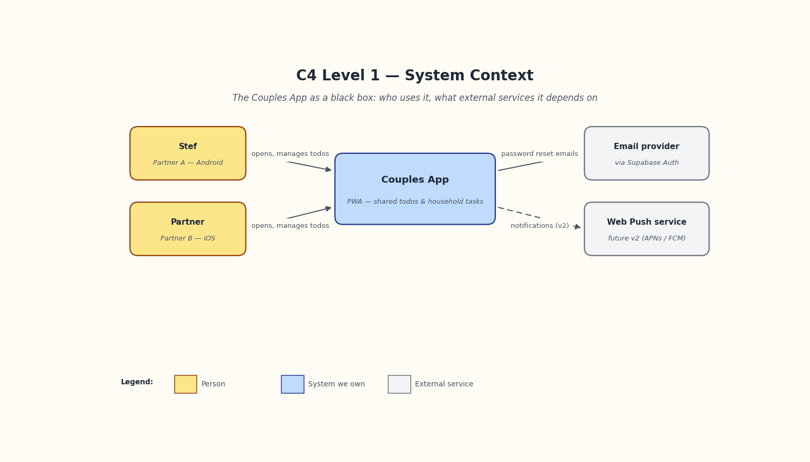

<details><summary>Mermaid source (for editing in-document)</summary>

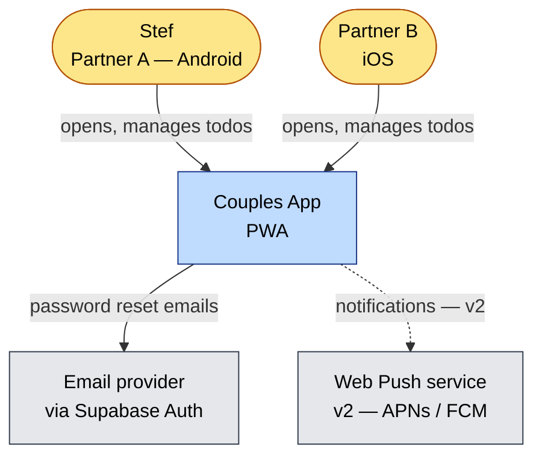

</details>

---

## C4 Level 2 — Containers

Deployable units and their wire protocols.

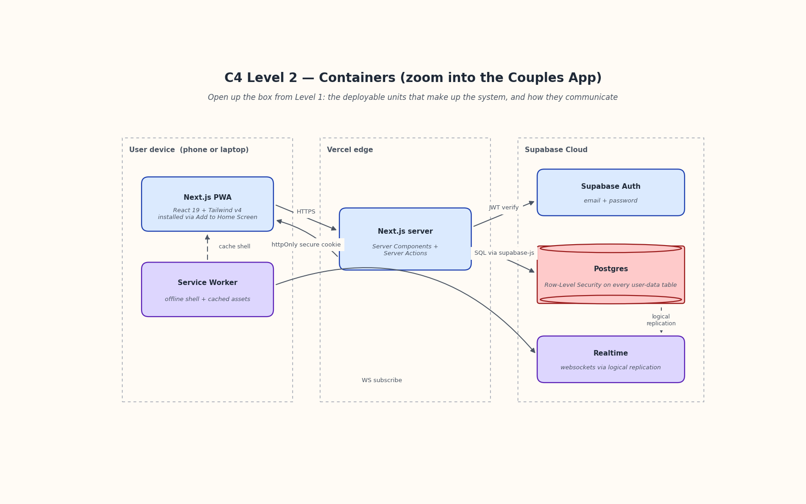

<details><summary>Mermaid source</summary>

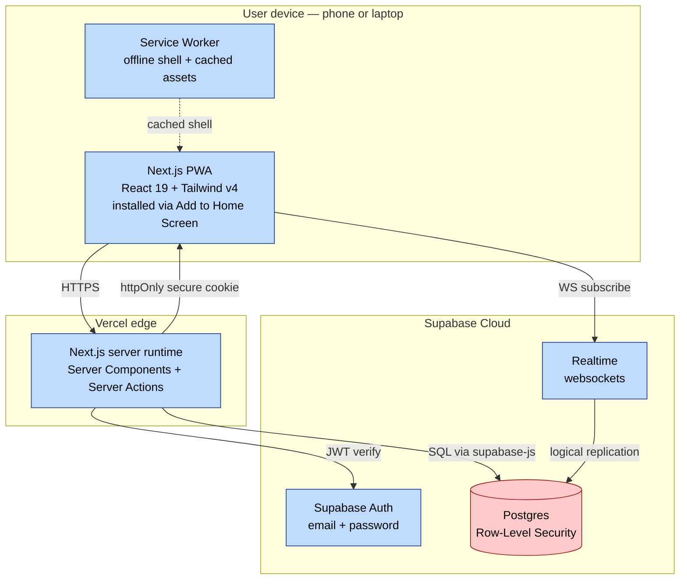

</details>

---

## C4 Level 3 — Components inside the Next.js app

How the four-layer architecture shows up inside the Next.js container.

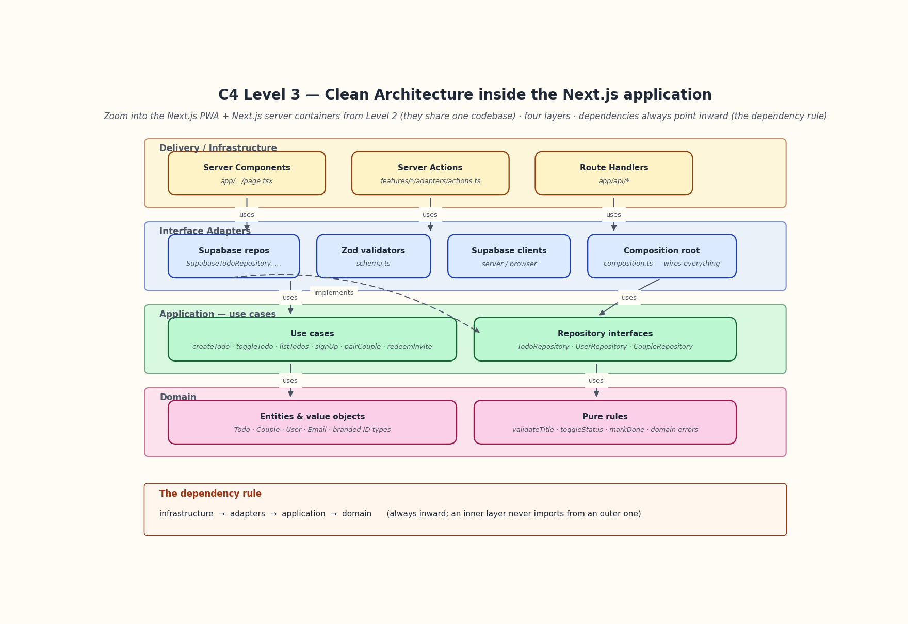

<details><summary>Mermaid source</summary>

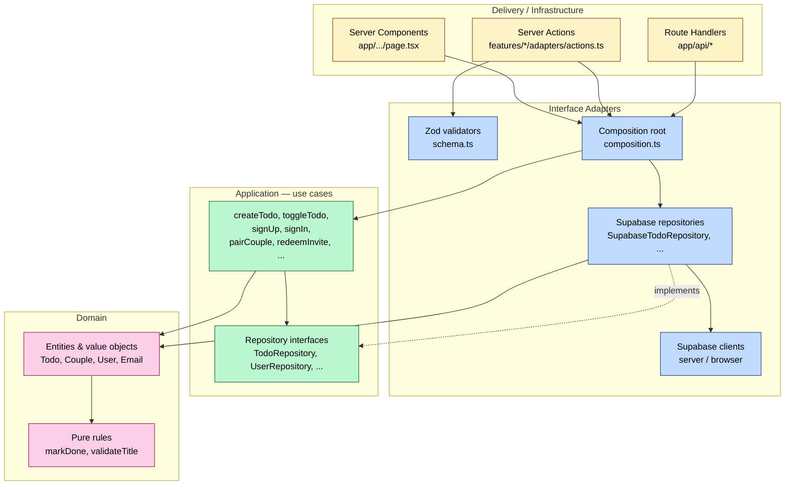

Note the implementation arrow: `Repos -.implements.-> Iface`. The repository interface is **defined** in the application layer; adapters implement it. That's dependency inversion (the D in SOLID) made concrete.

</details>

---

## Sequence diagram — Signup

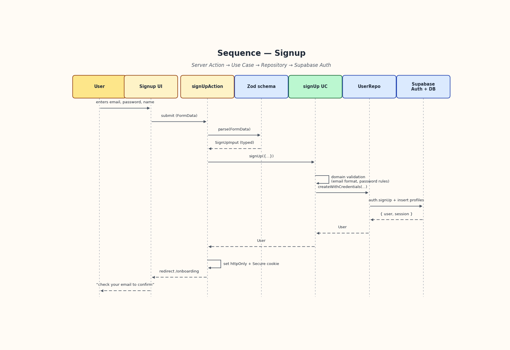

<details><summary>Mermaid source</summary>

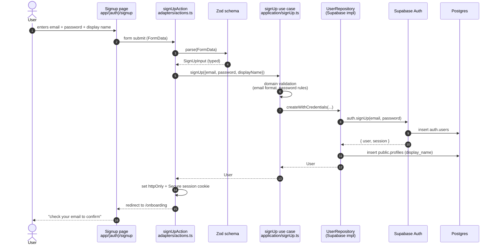

</details>

---

## Sequence diagram — Couple pairing (invite + redeem)

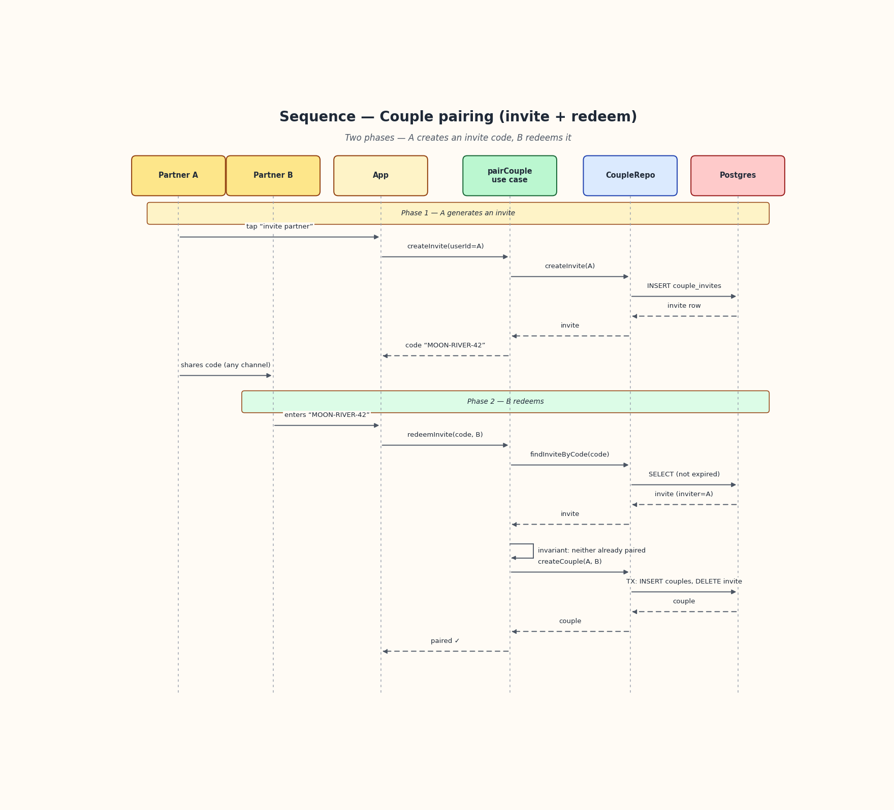

<details><summary>Mermaid source</summary>

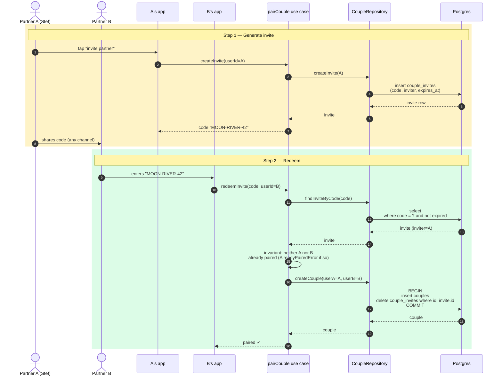

</details>

---

## Sequence diagram — Create todo with realtime fan-out

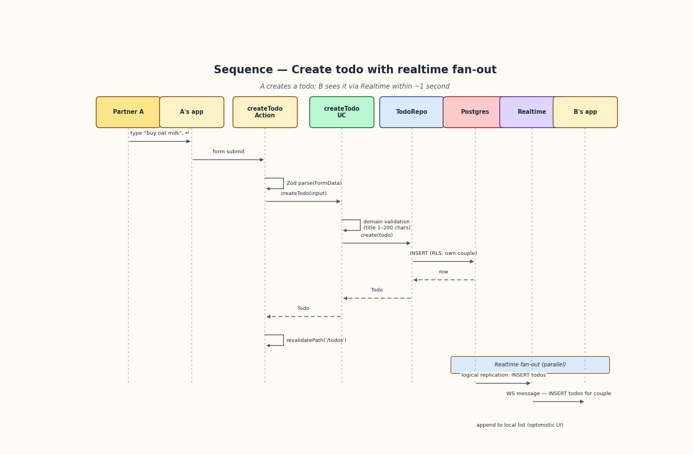

<details><summary>Mermaid source</summary>

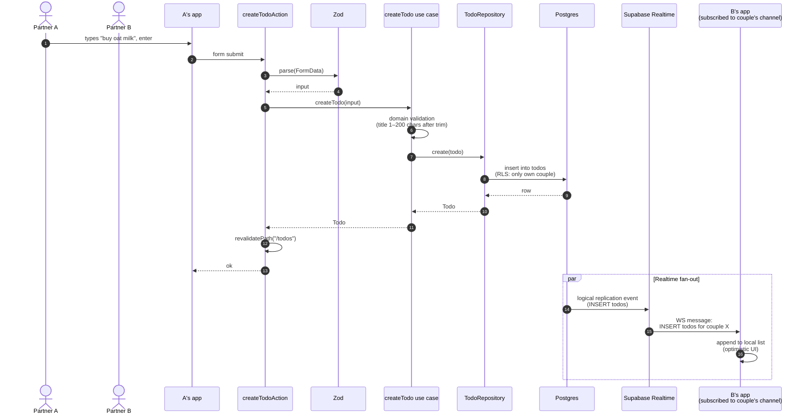

</details>

---

## SOLID, mapped to this codebase

| Principle | How it shows up here |
|---|---|
| **S — Single Responsibility** | Each use case file does one thing (`createTodo.ts`). Each repository implements one entity's persistence. UI components render, they don't hold domain rules. |
| **O — Open/Closed** | New features = new folder under `src/features/`. Existing files stay untouched. Adding a recurring-todo behaviour = new use case + (maybe) new repo method, never modifying `createTodo.ts`. |
| **L — Liskov Substitution** | Repository interfaces are honest contracts. Tests substitute fake repos for real Supabase repos and the use case behaves identically. |
| **I — Interface Segregation** | Repositories are scoped per entity (`TodoRepository`, not `MegaRepository`). Use case `Deps` types only request what each case actually needs. |
| **D — Dependency Inversion** | Use cases depend on repository **interfaces** defined in `application/`. Adapters in `adapters/` implement them. The dependency arrow points from the concrete (Supabase) toward the abstract (interface). |

---

## Dependency Injection — how it's wired

We use **manual functional DI**: factory functions take a `Deps` object, the composition root assembles them with real implementations.

### A use case is a factory

```ts
// src/features/todos/application/createTodo.ts
export interface CreateTodoDeps { todos: TodoRepository }

export function makeCreateTodo({ todos }: CreateTodoDeps) {
  return async function createTodo(input: CreateTodoInput): Promise<Todo> {
    // domain validation, then:
    return todos.create({ /* ... */ })
  }
}
```

### The composition root wires real impls

```ts
// src/features/todos/adapters/composition.ts
export function makeTodosModule() {
  const supabase = createServerSupabaseClient()
  const todos = makeSupabaseTodoRepository(supabase)
  return {
    createTodo: makeCreateTodo({ todos }),
    listTodos:  makeListTodos({ todos }),
    toggleTodo: makeToggleTodo({ todos }),
  }
}
```

### Tests inject fakes

```ts
const fakeRepo: TodoRepository = { /* in-memory */ }
const createTodo = makeCreateTodo({ todos: fakeRepo })
await createTodo({ /* ... */ })
```

No DI container, no decorators, no runtime magic. Just functions and types.

---

## Adding a new feature — checklist

When you add a feature, do it **in this order** so dependencies stay clean:

1. **Domain first.** What entities and rules? Write them as pure TS in `domain/`. Test them with Vitest — no mocks needed.
2. **Application layer.** Define repository interface(s) + use case factories. Test use cases with in-memory fake repos.
3. **Adapters.** Implement the Supabase repository. Write Zod schemas. Write the server action that parses input and calls the use case via the composition root.
4. **Delivery.** Add the page in `app/`. Wire it to the server action. Build the UI with shadcn primitives.
5. **Update docs.** Add the feature line to `FEATURES.md` (mark planned/in-progress/shipped). If the feature required new tech or changed an architectural decision, write an ADR.

If any of these steps are skipped, the feature isn't done.

---

## What this architecture is NOT trying to do

- It is not microservices. We are a single Next.js app + Supabase backend.
- It is not event-sourcing or CQRS. Direct CRUD via repositories is fine for our scale.
- It is not vendor-agnostic at all costs. Supabase is fine to depend on at the *adapter* layer; what we protect is the domain and application layers from leaking framework concerns.
- It is not a place to over-engineer. If a use case is `await todos.list()` with no domain logic, the use case is allowed to be that small.
